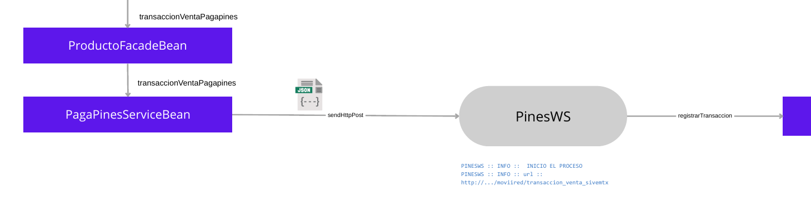

# Informe #723573 Validacion Logs Moviired

# Resumen

Al intentar procesar una compra de **PagaPines** el servicio `PinesWS` (microservicio dentro de `sivemtx`) intentó insertar un registro en la tabla `DC_PIN_TRANSACCIONES` pero falló porque el campo **COD_MUNICIPIO** llegó como `NULL`. Esa inserción fallida provocó una excepción en la base de datos (ORA-01400) y, como consecuencia, **no se envió el correo de comprobante al cliente**.

# Causa

- **Causa raíz:** El parámetro `COD_MUNICIPIO` es `NULL` y la columna `COD_MUNICIPIO` en la tabla `DC_PIN_TRANSACCIONES` no acepta `NULL`.
- **Efecto inmediato:** La llamada al procedimiento almacenado `DATACENTER.PKG_PINES.PR_REGISTRAR_TRANSACCION` lanza una excepción ORA-01400 al intentar insertar el registro.
- **Impacto de negocio:** El proceso detecta el error y lo controla internamente, por lo que **no se envía el correo con el comprobante** al cliente.

# Evidencia Log sivemtx

A continuación se presenta el fragmento de log registrado en el Nodo 1 del servicio `sivemtx`: 

```
2025-04-01 09:46:43,728 INFO  [com.datacenter.sivemtx.core.filter.SivemTxWSFilterRequest] (default task-9) SEGURIDAD :: INFO :: /SivemTxWS/rest/pines/registrarTransaccion::application/json
2025-04-01 09:46:43,728 ERROR [com.datacenter.sivemtx.core.filter.SivemTxWSFilterRequest] (default task-9) Error obteniendo el request jsonObject: org.codehaus.jettison.json.JSONException: JSONObject["codigoVendedor"] not found.
2025-04-01 09:46:43,729 INFO  [com.datacenter.sivemtx.productos.pines.ws.PinesTxRest] (default task-9) SIVEMTX:: PINESWS :: INFO :: INICIO registrar Transaccion
2025-04-01 09:46:43,729 INFO  [com.datacenter.sivemtx.productos.pines.ws.PinesTxRest] (default task-9) SIVEMTX:: PINESWS :: INFO :: :: REQUEST :: registrarTransaccion :: {"respuestaDTO":{"errorCode":"00","errorMessage":"OK","transactionId":"ON250401.0946.G62016","amount":"16900","iva":"19","ivaValue":"2698","valueBeforeIva":"14202","authorizationCode":"00000000001666640497","pin":"qWDoaK8YTaGwjyI418pAX2Rg2S63J+kpVTbNJ6Va4tdHsKrlQ7RnByg\u003d","exito":true,"mensajes":[]},"solicitudDTO":{"issuerId":"A807-32A7","correlationId":"56117","issueDate":"20250401094642.795","phoneNumber":"3157155213","source":"CHANNEL","ip":"172.20.56.254","amount":"16900","issuerLogin":"GELSA01","email":"luvemo1076@gmail.com","eanCode":"196742087147","zipCode":"","channel":"API","municipio":"","oficina":"15","puntoDeVenta":"001","codigoAsesor":"740001","idOperador":"1","canalId":"BTMA"},"canalId":"BTMA"}
2025-04-01 09:46:43,729 INFO  [com.datacenter.sivemtx.productos.pines.facade.PinesServiceBean] (default task-9) SIVEMTX:: PINESWS :: INFO :: SOLICITUD :: registrarTransaccion  {"respuestaDTO":{"errorCode":"00","errorMessage":"OK","transactionId":"ON250401.0946.G62016","amount":"16900","iva":"19","ivaValue":"2698","valueBeforeIva":"14202","authorizationCode":"00000000001666640497","pin":"qWDoaK8YTaGwjyI418pAX2Rg2S63J+kpVTbNJ6Va4tdHsKrlQ7RnByg\u003d","exito":true,"mensajes":[]},"solicitudDTO":{"issuerId":"A807-32A7","correlationId":"56117","issueDate":"20250401094642.795","phoneNumber":"3157155213","source":"CHANNEL","ip":"172.20.56.254","amount":"16900","issuerLogin":"GELSA01","email":"luvemo1076@gmail.com","eanCode":"196742087147","zipCode":"","channel":"API","municipio":"","oficina":"15","puntoDeVenta":"001","codigoAsesor":"740001","idOperador":"1","canalId":"BTMA"},"canalId":"BTMA"}
2025-04-01 09:46:44,124 INFO  [com.datacenter.sivemtx.productos.pines.facade.PinesServiceBean] (default task-9) SIVEMTX:: PINESWS :: INFO :: FIN::SP::REGISTRAR_TRANSACCION_PINES : {"facturaPrefijo":"PGEL","facturaNumero":"9825015","ejecucion":false,"mensaje":"Excepcion al insertar en tabla DC_PIN_TRANSACCIONES =>ORA-01400: no se puede realizar una inserción NULL en (\"DATACENTER\".\"DC_PIN_TRANSACCIONES\".\"COD_MUNICIPIO\")","nota":""}
2025-04-01 09:46:44,130 INFO  [com.datacenter.sivemtx.productos.pines.facade.PinesServiceBean] (default task-9) SIVEMTX:: PINESWS :: INFO :: RESPUESTA PROCEDIMIENTO ENCRIPTADO: {"IDOPERADOR":"1","CODOPERADOR":"1","ESTADO":"ACTIVO","NOMBRE":"PagaPines","URLOPERADOR":"http://aliadomoviired.dcsas.com.co:20116/moviired-api/digitalContent/v1","URLCATEGORIAS":"/pines/categories","URLPINES":null,"URLVENTAS":"/pines","FECINGOPE":"20211011000000","LLAVE":"W7U0J/0JIBsbNGLdePa51OddSvL1Av0sBg9zvSuPT+KJowPFQA2U5w=="}
2025-04-01 09:46:44,130 INFO  [com.datacenter.sivemtx.productos.pines.facade.PinesServiceBean] (default task-9) SIVEMTX:: PINESWS :: INFO :: keyOperador: 2021101100000011
2025-04-01 09:46:44,138 INFO  [com.datacenter.sivemtx.productos.pines.facade.PinesServiceBean] (default task-9) SIVEMTX:: PINESWS :: INFO :: FIN METODO ENCRIPTADO
2025-04-01 09:46:44,138 INFO  [com.datacenter.sivemtx.productos.pines.facade.PinesServiceBean] (default task-9) SIVEMTX:: PINESWS :: INFO :: Request :: consultarParametros  {"field":"PARAM_CANALES_EXCLUIDOS_DESCENCRIPCION_PIN"}
2025-04-01 09:46:44,141 INFO  [com.datacenter.sivemtx.productos.pines.facade.PinesServiceBean] (default task-9) SIVEMTX:: PINESWS :: INFO :: FIN consultar Parametros
2025-04-01 09:46:44,141 INFO  [com.datacenter.sivemtx.productos.pines.facade.PinesServiceBean] (default task-9) SIVEMTX:: PINESWS :: INFO :: Response :: consultar Parametros  {"status":"OK","codeServer":"0","messageServer":"Exito","field":"{\"CLAVE\":\"PARAM_CANALES_EXCLUIDOS_DESCENCRIPCION_PIN\",\"DESCRIPCION\":\"Canales excluidos para la descencripcion de pin\",\"APLICACION\":\"PINES\",\"VALOR\":\"PC\",\"SEGURIDAD\":\"N\"}"}
2025-04-01 09:46:44,141 INFO  [com.datacenter.sivemtx.productos.pines.facade.PinesServiceBean] (default task-9) Continuará el proceso de envío de correo de forma asíncrona para: luvemo1076@gmail.com
2025-04-01 09:46:44,142 INFO  [com.datacenter.sivemtx.productos.pines.facade.PinesServiceBean] (default task-9) SIVEMTX:: PINESWS :: INFO :: Request :: consultarParametros  {"field":"PARAM_CANALES_EXCLUIDOS"}
2025-04-01 09:46:44,151 INFO  [com.datacenter.sivemtx.productos.pines.facade.PinesServiceBean] (default task-9) SIVEMTX:: PINESWS :: INFO :: FIN consultar Parametros
2025-04-01 09:46:44,151 INFO  [com.datacenter.sivemtx.productos.pines.facade.PinesServiceBean] (default task-9) SIVEMTX:: PINESWS :: INFO :: Response :: consultar Parametros  {"status":"OK","codeServer":"0","messageServer":"Exito","field":"{\"CLAVE\":\"PARAM_CANALES_EXCLUIDOS\",\"DESCRIPCION\":\"Canales excluidos para envio de correo desde sivemTx\",\"APLICACION\":\"PINES\",\"VALOR\":\"BTMI,BTMA,BTW\",\"SEGURIDAD\":\"N\"}"}
2025-04-01 09:46:44,152 INFO  [com.datacenter.sivemtx.productos.pines.facade.PinesServiceBean] (default task-9) SIVEMTX:: PINESWS :: INFO :: RESPUESTA :: registrarTransaccion  {"status":"OK","codeServer":"99","messageServer":"Excepcion al insertar en tabla DC_PIN_TRANSACCIONES \u003d\u003eORA-01400: no se puede realizar una inserción NULL en (\"DATACENTER\".\"DC_PIN_TRANSACCIONES\".\"COD_MUNICIPIO\")","transaccionRespuesta":{"errorCode":"00","errorMessage":"OK","transactionId":"ON250401.0946.G62016","amount":"16900","iva":"19","ivaValue":"2698","valueBeforeIva":"14202","authorizationCode":"00000000001666640497","pin":"INCTT3VXVUEXA","facturaPrefijo":"PGEL","facturaNumero":"9825015","exito":true,"mensajes":[]}}
2025-04-01 09:46:44,152 INFO  [com.datacenter.sivemtx.productos.pines.ws.PinesTxRest] (default task-9) SIVEMTX:: PINESWS :: INFO :: :: RESPONSE :: registrar Transaccion :: {"status":"OK","codeServer":"99","messageServer":"Excepcion al insertar en tabla DC_PIN_TRANSACCIONES \u003d\u003eORA-01400: no se puede realizar una inserción NULL en (\"DATACENTER\".\"DC_PIN_TRANSACCIONES\".\"COD_MUNICIPIO\")","transaccionRespuesta":{"errorCode":"00","errorMessage":"OK","transactionId":"ON250401.0946.G62016","amount":"16900","iva":"19","ivaValue":"2698","valueBeforeIva":"14202","authorizationCode":"00000000001666640497","pin":"INCTT3VXVUEXA","facturaPrefijo":"PGEL","facturaNumero":"9825015","exito":true,"mensajes":[]}}
2025-04-01 09:46:44,152 INFO  [com.datacenter.sivemtx.productos.pines.ws.PinesTxRest] (default task-9) SIVEMTX:: PINESWS :: INFO :: FIN registrarTransaccion
```

Respuesta del servicio:

```json
{
    "status": "OK",
    "codeServer": "99",
    "messageServer": "Excepcion al insertar en tabla DC_PIN_TRANSACCIONES \u003d\u003eORA-01400: no se puede realizar una inserción NULL en (\"DATACENTER\".\"DC_PIN_TRANSACCIONES\".\"COD_MUNICIPIO\")",
    "transaccionRespuesta": {
        "errorCode": "00",
        "errorMessage": "OK",
        "transactionId": "ON250401.0946.G62016",
        "amount": "16900",
        "iva": "19",
        "ivaValue": "2698",
        "valueBeforeIva": "14202",
        "authorizationCode": "00000000001666640497",
        "pin": "INCTT3VXVUEXA",
        "facturaPrefijo": "PGEL",
        "facturaNumero": "9825015",
        "exito": true,
        "mensajes": []
    }
}
```

<aside>
💡

Nota: aunque algunos campos de la transacción están presentes (`pin`, `facturaNumero`, `exito:true`), la inserción en la tabla falló por la columna `COD_MUNICIPIO` nula.

</aside>

# Flujo y punto exacto de la falla: Explicación simple

1. Cliente realiza una compra de PagaPines vía API.
2. `PinesWS` recibe la solicitud y llama al procedimiento almacenado `PR_REGISTRAR_TRANSACCION`.
3. El procedimiento intenta insertar un registro en `DC_PIN_TRANSACCIONES`.
4. La columna `COD_MUNICIPIO` recibe `NULL` → la base de datos rechaza la inserción → ORA-01400.
5. El servicio captura la excepción y, por la lógica actual, marca el proceso como con error y **no** activa el envío del comprobante por correo.

# Flujo y punto exacto de la falla: Explicación detallada

## Arquitectura: Representación Grafica

A continuación se presenta gráficamente la arquitectura y los pasos que se ejecutan durante el proceso de una transacción del producto PagaPines

[Copia de Flujo Pines Billetera.pdf](Copia_de_Flujo_Pines_Billetera.pdf)


## Análisis de Código Fuente

Partiendo de que sabemos que el error se genera en el microservicio de `PinesWS` (`Sivemtx`), nos ubicamos en el punto exacto del llamado al microservicio `PinesWS`:



A continuación se adjunta fragmento de Código donde se captura la respuesta de `PinesWS`


PagaPinesServiceBean.java

La respuesta se retorna a traves del flujo hasta llegar al llamado Origen `ReglasEjecucionProductoPagaPines`


En este punto, al validar si el response fue exitoso entra por el bloque `else` y procede a lanzar exception mediante `throw new`


ReglasEjecucionProductoPagaPines.java

A continuación, el retorno es capturado por el llamado inmediato en `ReclaEjecucionTransaccionMain`


ReclaEjecucionTransaccionMain.java

Como se puede observar en el fragmento de código, se captura la excepción lanzada y setea valores a las variables `errorEjecutarTransaccion`, `resultadoEjecucion.setError`, `resultadoEjecucion.setMensajeError`, `errorReglaEjecucion`

Si deslizamos hacia abajo, nos encontramos con el siguiente fragmento de código:


ReclaEjecucionTransaccionMain.java. En este punto del proceso, Linea 323 el valor de la variable *enviarCorreoError* es False, dado que el valor de esta variable se altera bajo otros escenarios que no corresponden al proceso de transacción de PagaPines

dentro del llamado `Linea 318 -> metodos.finalizarTransacción` del fragmento de código anterior, vemos lo siguiente:


ReglaEjecucionServiceBean.java

Entra por el bloque `else` y NO envía el correo al cliente dado que la variable booleana `enviarCorreoComprobanteTransaccion` se inicializa con valor `false` y este valor no es alterado en ningún instante dentro del bloque. 

Se invoca el llamado a la función de envío de correo de comprobante SOLO SI `enviarCorreoComprobanteTransaccion` es igual a `true`


# Por qué NO se envió el correo

- En el código de `ReglaEjecucionServiceBean` la variable `enviarCorreoComprobanteTransaccion` está inicializada como `false` en el flujo que maneja este tipo de error.
- Dado que el proceso detecta y controla la excepción localmente, la ruta que dispara el envío de correo **no se ejecuta**.

# Conclusión

El comprobante NO fue enviado desde `BilleteraVirtualWS` porque:

- La inserción en `DC_PIN_TRANSACCIONES` falló por `COD_MUNICIPIO = NULL`.
- La lógica actual del proceso maneja ese error internamente y no activa el envío de correo.